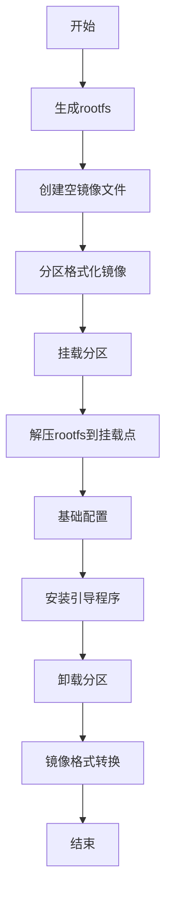
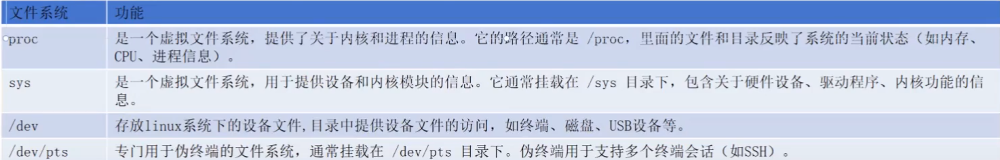
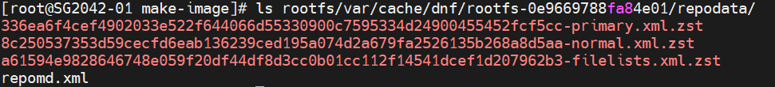
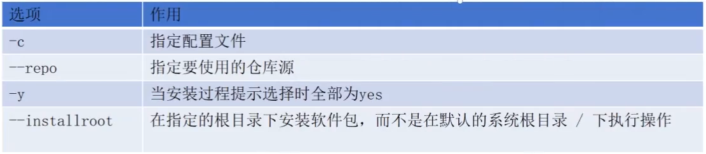
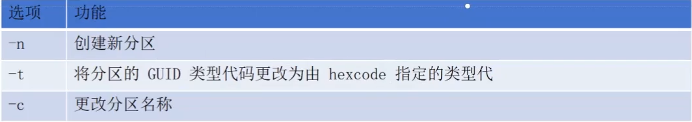
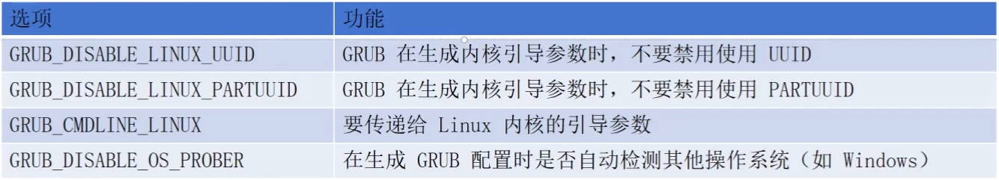
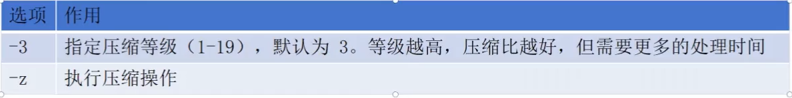
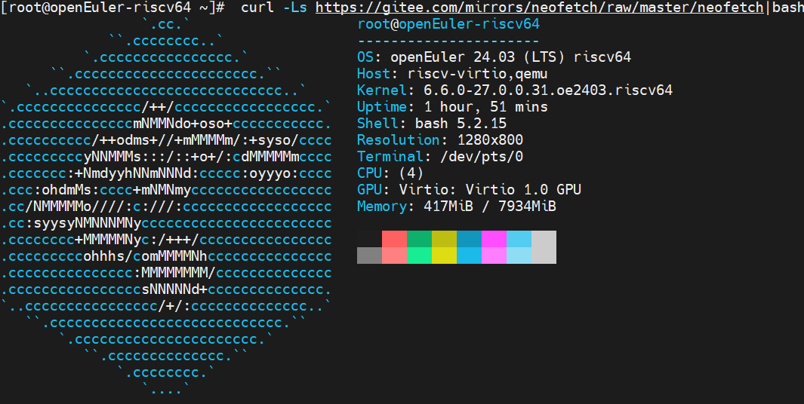

#   工具、通识、思想
##  git
Gitee 提供了基于 SSH 协议的 Git服务，在使用 SSH 协议访问仓库仓库之前，需要先配置好账户/仓库的SSH公钥。
	
    ssh-keygen -t rsa -b 4096 -C "gitee SSH key" 		#“xxx”只是生成的sshkey 的标识，不是密钥对名字。
    Generating public/private rsa key pair.
    Enter file in which to save the key (/root/.ssh/id_rsa): gitee-obsserver				
    Enter passphrase (empty for no passphrase):
    Enter same passphrase again:
    Your identification has been saved in gitee-obsserver
    Your public key has been saved in gitee-obsserver.pub
    The key fingerprint is:
    SHA256:lAgj2PWaDNmUz0jOo4j1RwlXmEN5rOpdFIApMze6cxI zhdizz@163.com
    The key's randomart image is:
    +---[RSA 4096]----+
    | o..==oB.        |
    |. ==O+*.+.       |
    |  oX.Bo=o.       |
    |  Eo=o*..        |
    |.o =++ .S        |
    |o = + . .        |
    |   = o .         |
    |    . .          |
    |                 |
    +----[SHA256]-----+


密钥对不要改名字，容易验证失败

2、将公钥复制到gitee的个人中心-SSH公钥

3、验证

    ssh -T git@gitee.com

#   实际的包和虚拟包：

    apt-cache show A

如果包 A 显示 Provides 字段，那么 A 是 实际提供者，而 Provides 字段中的包是 虚拟包 或 别名。

反过来，如果 apt-cache showpkg 显示的包没有 Provides 字段，它通常是 实际包，没有别名或虚拟包的概念。

#   协议

“组件间完整的交互规则集合”，包含了调用方式、数据格式、行为约定、错误处理等约定。内核中也常被叫做“接口（规范）“。名字的不同主要是因为：

*   “协议（Protocol）” 这个词更常用于跨系统、跨设备的交互（如网络协议、硬件协议、UEFI 协议），强调 “不同实体间的通用规则”。

*    “接口（Interface）”“操作集（Operations）” 等词强调 “模块间的调用约定”，更常用于系统内部组件协作，一般是在内核中使用的术语。

两者本质规则的完整性并无区别。
#   debian
##  1、想获取 Ubuntu 24.04（代号 noble）中 riscv64 架构下的所有包的详细信息 。

方法一：查看Packages 文件（最稳妥）
获取：.../dists/noble/main/binary-riscv64/Packages.gz文件。

方法二：用 apt 工具配合 riscv64 架构模拟（）
apt，可以直接配置 riscv64 仓库并查询（本地不一定要是 riscv64 架构）。
编辑 /etc/apt/sources.list.d/riscv64.list：

    deb [arch=riscv64] http://ports.ubuntu.com/ noble main universe multiverse restricted
然后执行：

    dpkg --add-architecture riscv64
    apt update
    apt list -a bash:riscv64


##  2、命令
### 2.1、查看依赖

详细信息（可查看反向提供者Reverse Provides，即谁能提供该包）：

    apt-cache showpkg packname

简单查询安装来源：

    apt show packname（会显示provides的包或依赖）

所有源或本地包信息：

    apt policy packname 

### 2.2、比较版本

比如比较 3.1.3.~ 和 3.1.3的版本大小：

    dpkg --compare-versions "3.1.3.~" "gt" "3.1.3" && echo yes || echo no

“gt”是大于（greater than）的缩写，输出yes表示前者大于后者。
“lt”是小于（less than）的缩写，输出yes表示前者大于后者。
“eq”是等于（equal）的缩写，输出yes表示前者等于后者。


### 2.3、查看包的文件

    dpkg -L packname

### 2.4、查看包的安装来源

    apt-cache show packname
#    操作系统
##  相关概念
|   定        义  |    核 心  内  容  | 定  义  |
| ------------- | --------------- | -------- | 
| OS 发行版 | 内核、软件仓库（RPM/DEB 包）、系统工具（Shell、图形界面）、开发环境、默认配置| 完整操作系统产品（如 Ubuntu、CentOS）| 
| OS 镜像 | rootfs、内核、initrd、引导程序（GRUB）、分区表信息| 用于安装或部署的镜像文件（如 ISO、云镜像）| 
| rootfs | 基础命令（/bin、/sbin）、系统配置（/etc）、共享库（/lib、/usr/lib）、用户数据（/home）| 操作系统启动后加载的根文件系统| 


##  原理
### 启动
####    Initrd
initrd 即是初始内存盘（initial RAM disk），作用：

*   Linux 内核启动早期需要用到的临时文件系统

*   内核启动时，挂载它作为根文件系统的临时起点，然后再切换到实际 rootfs 

*  本质就是一个压缩包（通常 cpio.gz 或 initramfs），放在内存里让 Linux 内核读。里面通常包含：

    * 必要的驱动模块（如文件系统驱动、块设备驱动）
   * 初始启动程序（init）
   * 必要的工具和配置

####    Linux 内核启动前提
*   内核镜像已被加载到内存中
*   内核能获取到 initrd 的位置信息
*   内核具备挂载 initrd 的基础能力


### 内存管理

(1)可执行文件执行过程

早期操作系统，处理文件时，是把文件全部从磁盘搬到内存（或者是内存缓冲区）。

现代操作系统，是会先`解析文件头`；
解析之后，`建立段映射`，把磁盘中的对应片段映射到相应的虚拟内存页上）；
然后`按需加载`，当 CPU 访问某页时，`缺页异常触发`，再把对应的内容搬到物理内存对应页。


Bootloader——U-Boot
1、configs目录：通常定义不同硬件平台或系统配置的编译选项。
每个文件通常代表一个硬件平台的配置文件，以_defconfig 结尾，类似于 Linux 内核的配置文件。
文件内容包括各种宏定义（例如 CONFIG_*），控制 U-Boot 在编译时的行为。
例如：myboard_defconfig中：

    CONFIG_ARM=y						#启用 ARM 架构支持。
    CONFIG_SYS_TEXT_BASE=0x80000000	#指定 U-Boot 在内存中的起始地址。
    CONFIG_CMD_NET=y					#启用 USB 支持。
    CONFIG_CMD_USB=y					#启用 USB 支持。

##  发行版
###   构建过程

严格意义（理论，《Linux From Scratch》）上，构建某个版本系统的完整流程：

`Host System → Temporary Toolchain → Final System（Final LFS System）`

在工程实践中，完整的OS发行版通常数千个包。为了提高构建效率，提高可维护性，会采用分层构建，增加一个BaseOS阶段，可以用于快速验证。：

`Host System → Temporary Toolchain → Final Toolchain → Basic System/BaseOS → Final LFS System`

*   Host System：构建目标系统的宿主系统，版本等没有特定要求，只要与目标系统 glibc/gcc ABI 兼容即可，一般采用目标系统的上个版本或者上游发行版。
*   Temporary Toolchain：使用宿主系统的工具链，编译“目标系统的工具链源码”得到的。
*   BaseOS：构建的基础包集合（bash, coreutils, rpm, yum, systemd 等）。
*   Temporary Toolchain → Final Toolchain的过程

| 阶段     | 名称  | 目标    | 输入（依赖）     | 输出（产物）    | 特点          |
| ------------- | ------------ | ------------- | ---------------- | ---------------- | ----------- |
| **Stage 1** | **构建完整可用的binutils**                  |  提供发布版 ld/as/objdump 等工具                    | 宿主机工具                          | binutils（包括as、ld等）                | 必须的基础二进制工具，GCC 的编译器阶段需要 binutils 来做链接和汇编                |
| **Stage 2** | **bootstrap 编译器（stage1 GCC）** | 构建一个“无 libc、纯内部运行、不能编译 C++”的初始编译器 | Stage 1 binutils                    | stage1 gcc（bootstrap gcc）                | 无 libc、无 C++，只提供最小的 C 前端 + 内部的 libgcc |
| **Stage 3** | **构建 glibc（或 musl）**                   | 构建目标系统完整的标准 C 库            | Stage 2 gcc、kernel headers           | glibc.so、crt1.o/crti.o/crtn.o、完整头文件      | glibc 会绑定并建立完整的系统 ABI（C 运行库），自此之后，toolchain 才真正属于“目标系统”                        |
| **Stage 4** | **构建最终的 GCC（stage2 GCC）**    | 构建目标系统的完整编译器            | Stage 2 gcc、Stage 3 glibc           | final gcc（C/C++ + libstdc++）             | 自举完成，完整优化，能构建目标版本的所有软件包                    |


*   Temporary Toolchain → Final Toolchain的过程

| 阶段     | 名称  | 目标    | 输入（依赖）     | 输出（产物）    | 特点          |
| ------------- | ------------ | ------------- | ---------------- | ---------------- | ----------- |
| **Stage 1** | **构建完整可用的binutils**                  |  提供发布版 ld/as/objdump 等工具                    | 宿主机工具                          | binutils（包括as、ld等）                | 必须的基础二进制工具，GCC 的编译器阶段需要 binutils 来做链接和汇编                |
| **Stage 2** | **bootstrap 编译器（stage1 GCC）** | 构建一个“无 libc、纯内部运行、不能编译 C++”的初始编译器 | Stage 1 binutils                    | stage1 gcc（bootstrap gcc）                | 无 libc、无 C++，只提供最小的 C 前端 + 内部的 libgcc |
| **Stage 3** | **构建 glibc（或 musl）**                   | 构建目标系统完整的标准 C 库            | Stage 2 gcc、kernel headers           | glibc.so、crt1.o/crti.o/crtn.o、完整头文件      | glibc 会绑定并建立完整的系统 ABI（C 运行库），自此之后，toolchain 才真正属于“目标系统”                        |
| **Stage 4** | **构建最终的 GCC（stage2 GCC）**    | 构建目标系统的完整编译器            | Stage 2 gcc、Stage 3 glibc           | final gcc（C/C++ + libstdc++）             | 自举完成，完整优化，能构建目标版本的所有软件包                    |

###   debian
####  1、想获取 Ubuntu 24.04（代号 noble）中 riscv64 架构下的所有包的详细信息 。

方法一：查看Packages 文件（最稳妥）
获取：.../dists/noble/main/binary-riscv64/Packages.gz文件。

方法二：用 apt 工具配合 riscv64 架构模拟（）
apt，可以直接配置 riscv64 仓库并查询（本地不一定要是 riscv64 架构）。
编辑 /etc/apt/sources.list.d/riscv64.list：

    deb [arch=riscv64] http://ports.ubuntu.com/ noble main universe multiverse restricted
然后执行：

    dpkg --add-architecture riscv64
    apt update
    apt list -a bash:riscv64


####  2、命令
##### 2.1、查看依赖

详细信息（可查看反向提供者Reverse Provides，即谁能提供该包）：

    apt-cache showpkg packname

简单查询安装来源：

    apt show packname（会显示provides的包或依赖）

所有源或本地包信息：

    apt policy packname 

##### 2.2、比较版本

比如比较 3.1.3.~ 和 3.1.3的版本大小：

    dpkg --compare-versions "3.1.3.~" "gt" "3.1.3" && echo yes || echo no

“gt”是大于（greater than）的缩写，输出yes表示前者大于后者。
“lt”是小于（less than）的缩写，输出yes表示前者大于后者。
“eq”是等于（equal）的缩写，输出yes表示前者等于后者。

##### 2.3、查看包的文件

    dpkg -L packname

##### 2.4、查看包的安装来源

    apt-cache show packname

###   rpm

| 情况 | 查询内容       | 属于哪种依赖               | 查询对象           | 示例命令                                            |
| -- | ---------- | -------------------- | -------------- | ----------------------------------------------- |
| 1  | 某包运行时需要什么  | 运行时依赖（Requires）      | `.rpm` 文件（未安装） | `rpm -qp --requires xxx.rpm`                    |
| 2  | 某包运行时需要什么  | 运行时依赖（Requires）      | 已安装包           | `rpm -q --requires 包名`                          |
| 3  | 哪些包在运行时需要它 | 反向运行时依赖              | 已安装包           | `rpm -q --whatrequires 包名`                      |
| 4  | 哪些包在运行时需要它 | 反向运行时依赖              | 仓库中任意包         | `dnf repoquery --whatrequires 包名`               |
| 5  | 某包构建时需要什么  | 构建时依赖（BuildRequires） | `.spec` 文件     | 查看 `BuildRequires:` 字段或 `dnf builddep xxx.spec` |
| 6  | 哪些包构建时需要它  | 反向构建依赖               | 只能通过源码/spec 分析 | 搜索所有 `.spec` 中有 `BuildRequires: 它`              |

##  镜像

视频链接：

https://www.bilibili.com/video/BV1LgtBeZEhL?spm_id_from=333.788.videopod.sections&vd_source=9f041185e6ba4744b71ebadad6fa8604

一般称作系统镜像，是一个包含 **操作系统、软件、配置文件及数据的完整副本的文件或文件集合** 。可以用来在同一台或不同的设备上 **恢复或部署系统**，**使得设备恢复到镜像创建时的状态** 。

特点：
完整性：可以作为系统的精确副本。
可引导性：安装或恢复系统的介质。
固定状态：反应系统在特定时间的状态，对于容灾和备份非常有用。

种类：
ISO镜像：常见的光盘镜像格式，通常作为操作系统的安装介质，如Linux发行版的安装盘。
**磁盘镜像**：包含整个磁盘或分区的完整副本，用来恢复磁盘的内容，如dd命令生成的镜像文件。
虚拟机镜像：虚拟机化平台的镜像，如VirtualBox的.vdi或者QEMU的qcow2，用于快速启动虚拟机实例。
容器镜像：包含一个轻量级的、独立运行的最小化环境，常用于Docker等容器平台。

###   磁盘镜像制作

大致流程：


   
####    准备rootfs.tgz

以制作openEuler的镜像为例,在目录中（packages.list rootfs.repo）

1、首先准备好软件包名单 [packages.list](./assets/packages.list)

2、配置好软件园仓库配置：

    [rootfs]
    name=rootfs
    baseurl=https://mirrors.huaweicloud.com/openeuler/openEuler-24.03-LTS/everything/riscv64/
    enabled=1
    gpgcheck=0

3、挂载特定的文件系统

    mkdir rootfs
    mkdir -p  rootfs/{dev,proc,sys}
    mount -t proc proc rootfs/proc
    mount -t sysfs sysfs rootfs/sys
    mount -o bind /dev rootfs/dev
    mount -t devpts pts rootfs/dev/pts

若没有挂载，则会在安装kernel软件包时出现问题。



4、安装软件包
生成软件包仓库元数据缓存

    dnf makecache -c rootfs.repo --repo rootfs --installroot=$(pwd)/rootfs

安装软件包

    dnf install  -c rootfs.repo --repo rootfs -y --installroot=$(pwd)/rootfs $(cat packages.list)

会有刚才下载操作的缓存



清除所有缓存

    dnf clean all --installroot=$(pwd)/rootfs



5、设置账号密码
转为哈希值，/etc/shadow 存储加密后的哈希值：

    encrypted_pw=$(openssl passwd -6 "openEuler12#$") 

前后需要填充以符合格式要求：

    shadow_string="root:$encrypted_pw:19598:0:99999:7:::"
    sed -i "s#root:.*#$shadow_string#g" rootfs/etc/shadow

    cat rootfs/etc/shadow

```bash
shadow_string='root:$6$4sWBbF5ZRNuxb2Sp$TtqaD7ckSAKbOq9TDDdS9xTShkQgEI0bF3u8Ybv02f6jpryZxDyHqclHPQlE1oJ1ZDaNpAuYbn6T7tUBwsLCG1:19598:0:99999:7:::'
#其中”TtqaD7ckSAKbOq9TDDdS9xTShkQgEI0bF3u8Ybv02f6jpryZxDyHqclHPQlE1oJ1ZDaNpAuYbn6T7tUBwsLCG1“是·openEuler12#$`的哈希值
sed -i "s#root:.*#$shadow_string#g" rootfs/etc/shadow
```
设置主机名

    echo openEuler-riscv64 > $(pwd)/rootfs/etc/hostname

设置权限

    mkdir -p rootfs/var/log/journal
    chmod +x rootfs/etc/rc.d/rc.local
    setcap cap_net_admin,cap_net_raw+ep rootfs/usr/bin/ping
    setcap cap_net_raw+ep rootfs/usr/bin/arping
    setcap cap_net_raw+ep rootfs/usr/bin/clockdiff


6、卸载挂载的文件系统

    umount rootfs/dev/pts
    umount rootfs/dev
    umount rootfs/sys
    umount rootfs/proc

7、打包

    tar -czvf rootfs.tgz -C $(pwd)/rootfs . 

8、制作完成,清理环境

    rm -rf rootfs

####    制作qcow2镜像

1、用truncate工具生成raw文件

    truncate -s 20G test-uefi.raw

raw原意为“未经加工”，也指的是未格式的磁盘，性能接近物理磁盘，raw格式就是一块纯纯的块文件。

2、分区
将这个镜像文件连接到一个 loop 设备上

    loopdev=$(losetup -fP --show test-uefi.raw)

对其分区（会把 GPT 分区表写入镜像文件，并定义各个分区（起始位置、大小、类型等）

    sgdisk -n 1:0:+512M -n 2:0:+512M -n 3:0:0 -t 1:ef00 -t 2:ef02 -t 3:8300 -c 1:efi -c 2:boot -c 3:oERV $loopdev 

ef00：EFI系统分区   ef02：BIOS引导分区  8300：Linux文件系统



在磁盘镜像上创建分区设备映射（device-mapper 机制），将其映射到系统的/dev/mapper/目录中

    kpartx -av $loopdev

Tips:
loop 镜像 + losetup + kpartx 这一整套流程，跟插入真实物理设备、识别和挂载非常相似，就是它的“软件模拟”版本。

loop 镜像的处理过程：
*   truncate + losetup 创建并加载一个虚拟硬盘。相当于“插入了一块虚拟硬盘”，系统看到的是 /dev/loop0

*   sgdisk 模拟对这个“虚拟硬盘”被分了区，但系统还没有完全识别出来这些“分区的实际设备”，这些分区还只是“裸设备”。

*   kpartx 就像是 系统重新扫描了这块磁盘的分区表，并在 /dev/mapper/ 下创建了真实可操作的分区映射设备 —— 类似“检测出插入的分区”。

*    mount 它们，就能像访问 SD 卡文件一样访问里面的内容。

3、格式化分区

    mkfs.fat -F 32 /dev/mapper/${loopdev#/dev/}p1 
    mkfs.fat -F 32 /dev/mapper/${loopdev#/dev/}p2
    mkfs.ext4 /dev/mapper/${loopdev#/dev/}p3

4、目录挂载

    mkdir -p rootfs
    mount -o loop /dev/mapper/${loopdev#/dev/}p3 rootfs
    mkdir -p rootfs/boot
    mount -o loop /dev/mapper/${loopdev#/dev/}p2 rootfs/boot
    mkdir -p rootfs/boot/efi
    mount -o loop /dev/mapper/${loopdev#/dev/}p1 rootfs/boot/efi

5、解压rootfs.tgz

    tar -xf rootfs.tgz -C rootfs

6、挂载特定文件系统

    mount -t proc proc rootfs/proc
    mount -t sysfs sysfs rootfs/sys
    mount -o bind /dev rootfs/dev
    mount -t devpts pts rootfs/dev/pts

7、安装grub2相关软件包

    dnf -c rootfs.repo --repo rootfs install -y --installroot=$(pwd)/rootfs grub2-efi-riscv64  grub2-efi-riscv64-modules efibootmgr

8、生成fstab文件

手动生成fastab文件，让操作系统管理不同文件系统的自动挂载

    touch rootfs/etc/fstab

    efi_uuid=$(blkid -s UUID -o value /dev/mapper/${loopdev#/dev/}p1)
    boot_uuid=$(blkid -s UUID -o value /dev/mapper/${loopdev#/dev/}p2)
    root_uuid=$(blkid -s UUID -o value /dev/mapper/${loopdev#/dev/}p3)

    echo "UUID=$root_uuid   /   ext4    rw,noatime  0   1" >> rootfs/etc/fstab
    echo "UUID=$boot_uuid   /boot   vfat    rw,noatime  0   2" >> rootfs/etc/fstab
    echo "UUID=$efi_uuid   /boot/efi   vfat    rw,noatime  0   2" >> rootfs/etc/fstab

9、配置grub

安装grub2引导程序，生成grub2启动菜单

    echo "GRUB_DISABLE_LINUX_UUID=false" >> rootfs/etc/default/grub
    echo "GRUB_DISABLE_LINUX_PARTUUID=false" >> rootfs/etc/default/grub
    echo 'GRUB_CMDLINE_LINUX="selinx=0 console=ttyS0 earlycon"' >> rootfs/etc/default/grub
    echo 'GRUB_DISABLE_OS_PROBER=true' >> rootfs/etc/default/grub
    
    chroot rootfs/ /bin/bash << "EOT"
    grub2-install --modules="part_gpt part_msdos" --bootloader-id=GRUB2 --efi-directory=/boot/efi --boot-directory=/boot/ --removable 
    grub2-mkconfig -o /boot/grub2/grub.cfg
    EOT



10、制作完成

目录卸载

    umount rootfs/boot/efi
    umount rootfs/boot
    umount rootfs/dev/pts
    umount rootfs/dev
    umount rootfs/sys
    umount rootfs/proc
    umount rootfs

关闭分区设备映射，取消回环设备的挂载
    
    kpartx -dv $loopdev
    losetup -d $loopdev
    ls /dev/mapper/
    losetup -l

11、raw文件格式转换

    qemu-img convert -f raw -O qcow2 test-uefi.raw test-uefi.qcow2

qcow2:目前主流的一种虚拟化镜像格式，是QEMU/KVM虚拟化平台的默认磁盘格式。支持动态分配空间，即虚拟磁盘的大小会随着虚拟机实际使用的空间增长，而不是一开始就占用全部大小。

12、镜像文件压缩

    zstdmt -3 -z test-uefi.qcow2 -o test-uefi.qcow2.zst



####    验证

#####   安装RISC-V架构的QEMU模拟器
 （在openEuler x86的虚拟机中）

安装软件包

```bash 
dnf makecache
dnf install vim make ninja-build gcc pkg-config glib2-devel pixman-devel acpica-tools cmake bzip2 \
    libaio-devel liburing-devel zlib-devel libcap-ng-devel libiscsi-devel capstone-devel \
    libseccomp-devel nettle-devel libattr-devel libjpeg-devel brlapi-devel libgcrypt-devel libslirp-devel \
    librdmacm-devel libibverbs-devel cyrus-sasl-devel  libuuid-devel pulseaudio-libs-devel curl-devel \
    gtk3-devel vte291-devel ncurses-devel numactl-devel lzo-devel snappy-devel dtc-devel libssh-devel   
```
源码编译安装

```bash 
wget https://download.qemu.org/qemu-8.2.6.tar.bz2
tar xf qemu-8.2.6.tar.bz2
cd qemu-8.2.6
```
riscv-64-linux-user 为用户模式，可以运行基于 RISC-V 指令集编译的程序文件, softmmu 为镜像模拟器，可以运行基于 RISC-V 指令集编译的linux镜像，为了测试方便，可以两个都安装；如果 --prefix 指定的目录

```bash 
./configure --target-list=riscv64-softmmu,riscv64-linux-user --prefix=/opt/qemu-8.2.6
make && make install
```
配置环境变量

```bash 
echo 'export PATH=/root/qemu/bin:$PATH' >> ~/.bashrc
source ~/.bashrc
qemu-system-riscv64 --version
```
#####   启动RISC-V QEMU环境

下载固件、启动脚本

```bash
wget https://mirrors.huaweicloud.com/openeuler/openEuler-24.03-LTS/virtual_machine_img/riscv64/RISCV_VIRT_CODE.fd
wget https://mirrors.huaweicloud.com/openeuler/openEuler-24.03-LTS/virtual_machine_img/riscv64/RISCV_VIRT_VARS.fd
wget https://mirrors.huaweicloud.com/openeuler/openEuler-24.03-LTS/virtual_machine_img/riscv64/start_vm.sh
```
修改脚本里的drive为新生成的qcow2镜像

```bash
bash start_vm.sh
ssh root@127.0.0.1 -p12055
```
验证结果

```bash
curl -Ls https://gitee.com/mirrors/neofetch/raw/master/neofetch|bash
```


###   镜像离线操作

不把镜像烧写到硬件（如 Milk-V 开发板）或启动虚拟机，直接在当前系统中 “穿透” 访问镜像里的完整系统文件，方便修改配置、预装软件、调试系统等。

eg:以openKylin-Embedded-V2.0-SP1-milk-v-pioneer-riscv64.img为例

####    给镜像 “虚拟出磁盘设备”
把 .img 镜像文件（本质是 “打包的磁盘数据”），映射成系统能识别的 “虚拟磁盘设备”（类似插入了一块虚拟硬盘）。

```bash
losetup -fP openKylin-Embedded-V2.0-SP1-milk-v-pioneer-riscv64.img
```
####    查看镜像的映射状态

验证上一步的映射是否成功，输出会显示 “哪个虚拟设备（/dev/loop0）对应哪个镜像文件”，确认映射关系正确（比如你这里 /dev/loop0 绑定了目标镜像）。


####    挂载镜像的 “根分区” 到本地目录
背景：嵌入式系统镜像通常分两个核心分区。
p1：boot 分区（存放启动文件、内核镜像，很小）；
p2：根分区（/ 分区，存放系统所有文件、软件、配置，是系统的核心）。（如果不确定可用`lsblk /dev/loop0`查看具体分区情况。）

把镜像中 p2 根分区，挂载到当前系统的某个目录（如：mnt 目录）

```bash 
mount /dev/loop0p2 mnt
```

####    挂载镜像的 “boot 分区” 到根分区的 boot 目录
把镜像的 boot 分区（p1）挂载到已挂载的根分区的 boot 子目录（mnt/boot），让镜像的文件系统结构完整（和真实启动后的系统一致：/boot 目录对应 boot 分区）。
如果需要修改启动配置（如 grub.cfg）、替换内核文件，必须挂载 boot 分区才能操作。

```bash 
mount /dev/loop0p1 mnt/boot
```

####    切换 “根目录上下文”，进入镜像的系统环境

把当前终端的 “根目录” 从你真实系统的 /，切换到 mnt 目录（即镜像的根分区）—— 相当于 “钻进” 了镜像系统里，后续执行的所有命令，都在镜像系统的环境中运行，而非真实系统。

```bash 
chroot mnt
```

####    事后处理
修改完镜像后，需按以下顺序卸载，避免镜像文件损坏：

1 退出 chroot 环境（回到真实系统）

```bash 
exit
```
2. 卸载 boot 分区

```bash 
umount mnt/boot
```
3. 卸载根分区

```bash 
umount mnt
```
4. 解除镜像与虚拟设备的绑定

```bash 
losetup -d /dev/loop0
```
##  rootfs复用
在系统移植时：rootfs 相对通用，可在不同平台/镜像间复用；通过替换 /boot（EFI + 内核 + initramfs）来适配硬件/启动方式。

### 原理前提

系统”用户空间与内核通过稳定的 syscall ABI 解耦“的分层设计。
用户程序 → 调用 glibc → （通过 syscall） → Linux 内核
使得同一套 rootfs 可以在不同内核、不同平台上复用的可能。

条件：在 CPU 架构一致、glibc 等用户态 ABI 生态兼容。

实质：用户态（以 glibc 为核心） ABI 兼容。

### 工程实践

（一）保留 rootfs，替换 boot（内核 + initrd + grub）。
（1）用新内核适配新板子 / 新驱动
（2）用户空间保持不变
（3）rootfs 更通用，boot 更强绑定硬件（适配新硬件的工作集中在 内核/boot 世界）。
（二）调整 grub.cfg，确保能正常启动：
（1）linux 后面的路径的文件，在 rootfs 的 /boot中存在。不存在内核加载不了。
（2）linux 行中的内核版本，必须和rootfs 里的 /lib/modules/<version>严格一致。
（3）initrd 路径文件在 rootfs 的 /boot中存在。
（4）包含“root=”，值一般为“/dev/vda2、/dev/sda2”形式，或者UUID=xxxx。
#   计算机组成原理

1、CPU架构设计的寄存器宽度决定地址长度（比如32位、64位）
*   CPU内部用多少位宽的寄存器来存地址（地址总线宽度）
*   这决定了CPU一次能处理的地址最大范围（寻址范围）

2、地址长度决定最大可寻址内存

*   地址寄存器是用来存放内存地址的，比如32位宽就表示最多能表示2³²个地址
*   每个地址对应内存中的一个字节（或其他单位）
*   所以CPU最多能访问2³²字节内存，也就是4GB

3、举例

*   地址长度 = “房间门牌号位数”，决定你最多有多少不同门牌
*   内存数量 = “你实际拥有多少房间”

4、总结
|     条目       | 含义                          | 举例                     |
|----------------------|-------------------------------|--------------------------|
| **CPU地址寄存器位宽** | 地址长度，决定最大可寻址的地址空间     | 32位CPU最大支持4GB内存   |
| **物理内存大小** | 实际可用的物理内存容量         | 你可能只装了2GB或8GB内存 |
| **操作系统与硬件架构** | 决定如何使用和管理地址空间     | 虚拟内存、内存映射等机制 |

补充
CPU 与硬件交互访问的方式有两种：
*   内存映射（现代主流）
*   独立的 “I/O 地址空间”（早期，现已基本被取代）

每个硬件（或硬件的不同功能模块）都需要一段独立的地址空间来映射自己的寄存器、缓存等资源（无论是内存映射的地址，还是早期的 I/O 地址），以避免地址冲突 。因此，如果系统中的硬件设备多的话，为了能够正常工作（CPU能和它们正常交互），所需要的地址空间范围也要更大。
早期 32 位系统（最大 4GB 地址空间）中，出现过 “明明装了 4GB 内存，系统却只识别到 3GB” 的情况（这就是典型的地址空间范围不够用，还有部分内存不能正常映射，无法被识别导致的）。

#   UEFI

*   前置知识：
    *   固件是预先烧录在硬件模块中的程序，负责初始化硬件模块，并控制硬件模块的运行。
    *   在一块板子（无论是 PC 主板、开发板、嵌入式设备）上，多个独立硬件模块（如 CPU、网卡、GPU、SSD/HDD 存储设备等）都有各自的固件（Firmware）。
    **而Flash 上的固件通常是系统级固件（比如 U-Boot、OpenSBI、UEFI 等），负责整个系统的启动。**

##   UEFI BOOT EXECUTION FLOW


| 启动阶段 | 作用                     |
|----------|--------------------------|
| SEC      | 搭建最小执行环境（汇编，启用 CAR）      |
| PEI      | 初始化内存（DRAM）和核心资源            |
| DXE      | 加载驱动，初始化各种设备，构建完整系统服务  |
| BDS      | 选择启动设备，引导 OS               |

###   SEC（Security Phase）：

当处理器（CPU）上电或重启后，它会从一个固定的地址（称为 Reset Vector，一般会被CPU映射到flash）开始执行指令，这就是启动流程的起点，也是 UEFI 执行的起点，标志着 SEC 阶段的开始。

SEC 阶段前期由**汇编语言**实现，运行在没有内存、没有堆栈的最原始状态。
其**首要任务是启用 Cache-as-RAM（CAR），即将 CPU 的缓存作为临时内存使用**，并在其中构建临时栈，为后续的 C 代码执行创建最小运行环境。
一旦临时栈建立，控制权便转移到 SEC 阶段的 C 函数，继续执行初始化逻辑，最终跳转到 PEI Core 模块的入口函数（即 PEI 阶段的入口），开始平台初始化阶段。

```bash
#重启事件
#临时内存
#安全的根
#信息交接
```
###   PEI（Pre-EFI Initialization）

最初，系统在**Temporary Memory（如 Cache-as-RAM）**中运行基础 C 代码，**PEI Core**调度各个 **PEIM 模块**完成对**处理器（Processor）、芯片组（Chipset）和主板（Board）的初始化**，其中**探测、初始化和验证物理内存**是关键任务，这一过程属于 **Pre-memory 阶段**。


当**内存初始化完成**后，系统进入 **Post-memory 阶段**，此时需要将 Pre-memory 阶段中保存在 CAR（Cache-as-RAM）中的**关键数据（如栈、HOB 等）迁移到已初始化完成的物理内存**。随后，继续调度**剩余的 PEIM 模块（如 DXE IPL 模块）**，DXE IPL 会加载并启动 DXE Core，至此 PEI 阶段结束，系统正式进入 DXE 阶段。

*   **PEI Core模块**：通常编译为一个 PE/COFF 格式的可执行映像，它负责加载、调度并执行各个 **PEIM（Platform Initialization Modules）**，以完成早期硬件初始化任务（如内存控制器、芯片、主板信息等），并为进入 DXE 阶段做好准备。
该模块的入口是一个 C 语言函数 PeiCore()，它是整个 PEI 阶段的入口函数。
当 SEC 阶段完成基础初始化（如建立堆栈）后，会显式调用该函数，其调用标志着 SEC 阶段的结束与 PEI 阶段的正式开始。DXE IPL（DXE Initial Program Loader） 通常是 PEI 阶段最后一个被调度执行的 PEIM 模块。
* **HOB（Hand-Off Block）**:一组特殊的数据结构，用于 **PEI 阶段和DXE 阶段**之间**传递系统信息**。
在 PEI 阶段，PEIM 模块根据硬件探测和初始化结果，动态构建和更新HOB，比如内存描述、CPU 信息、设备信息等。DXE 完全接管后，所有的物理内存初始化完成了，才没有用到HOB，包括：

    *   内存资源描述（如 Resource Descriptor HOB）
    *   CPU 信息
    *   启动设备顺序
    *   已加载的模块信息
    *   Firmware Volume 等其他关键系统数据

| 阶段              | 是否使用 HOB  | 用途说明                                      |
| --------------- | --------- | ----------------------------------------- |
| **Pre-memory**  | ✅ 是       | 初始构建 HOB，记录早期信息（如临时内存、启动顺序等）              |
| **Post-memory** | ✅ 是       | 添加系统内存信息、模块加载信息、数据迁移后进行更新等                |
| **DXE 阶段开始后**   | ✅ 读取，不再扩展 | DXE Core 解析并利用 HOB 来完成内存、驱动、服务等初始化工作      |
| **DXE 中期以后**    | ❌ 不再使用    | 系统切换为 Boot Services 机制，HOB 完成历史使命不再参与后续流程 |


*   **Pre-memory**：系统内存还没有初始化完成，没有可用的RAM空间，只有临时的 Cache-as-RAM 或片上RAM；
*   **Post-memory**：内存初始化完成，可以使用真正的系统RAM来存放数据结构和程序；

###   DXE（Driver Execution Environment） 


通过**加载驱动、初始化各种硬件设备、安装协议**等操作，逐步建立起 **Boot Services 环境**（包括内存服务、协议服务、设备驱动机制等），为系统引导做好准备。

关键任务包括：

*   内存服务初始化：建立内存管理机制，初始化内存映射表，为 Boot Services 和 Runtime Services 提供内存分配与释放支持。

*   设备枚举与驱动加载：DXE 阶段通过 PCI 总线（或其他总线）进行设备枚举，识别所有的 Bus、Bridge 和 Device。对每个设备，通过设备句柄上的协议（如 PciIoProtocol）匹配合适的 UEFI 驱动模块，加载驱动并初始化设备。

注：设备之间的连接（ConnectController）动作，主要在 BDS 阶段触发。

*   驱动依赖调度与链式展开：DXE 调度器依据驱动模块声明的依赖协议（Protocol）判断其是否可执行。满足条件的驱动会被调度加载并执行。新驱动可能会安装新的协议，进一步满足其他驱动的依赖，从而触发一个链式的驱动加载过程，逐步完善整个系统服务环境。

DXE 阶段加载大量驱动和服务，运行复杂的初始化逻辑，并支持动态内存分配，因此需要大量稳定且足够的内存空间。


#### UEFI Boot Services vs Runtime Services 对比表

| 比较维度             | Boot Services                                        | Runtime Services                                     |
|----------------------|------------------------------------------------------|------------------------------------------------------|
| 🔧 **用途**          | 提供 OS 启动前的服务：内存管理、驱动加载等         | 提供 OS 启动后仍可使用的服务：时间、变量、重启等   |
| ⏰ **使用阶段**      | DXE 和 BDS 阶段（OS 启动前）                         | RT 阶段（OS 启动后）                                |
| 🔚 **失效时机**      | 调用 `ExitBootServices()` 后立即不可用              | OS 启动后依然可用，直到系统关闭                     |
| 🧠 **典型函数**      | `AllocatePool`、`CreateEvent`、`LocateProtocol` 等  | `GetTime`、`GetVariable`、`ResetSystem` 等          |
| 📦 **结构体来源**    | `EFI_BOOT_SERVICES`                                   | `EFI_RUNTIME_SERVICES`                              |
| 🧱 **服务类型**      | 内存、事件、TPL、图像加载、协议操作等               | 实时时钟、NVRAM 变量、系统重启等                   |
| 🧬 **OS 中可用？**   | ❌ 不可（仅启动前使用）                             | ✅ 可（OS 可继续调用）                             |
| 📍 **接口访问方式** | `SystemTable->BootServices->XXX()`                  | `SystemTable->RuntimeServices->XXX()`               |

## 🔁 EFI_SYSTEM_TABLE 结构关系简图


###   BDS（Boot Device Selection）

**负责选择启动设备，并引导操作系统**。

BDS 阶段会根据配置选择启动设备，并加载 Boot Manager（如 GRUB、Windows Boot Manager 等）。


之前都是在准备环境，启动策略和显示界面都是在BDS阶段。定制化的内容主要是此阶段  。

###   TSL（Traditional System Loader）

**负责加载操作系统内核**。

TSL 阶段会执行Bootloader程序，加载操作系统的内核，并传递控制权给它，从而启动操作系统。

# 编译

很多软件都会有类似 “编译开关” 或配置系统”。

*   本质就是一堆宏定义或选项，通过这些选项控制最终编译出来的程序包含哪些功能。
*   底层软件偏硬件、启动和性能优化
*   上层软件偏功能、模块和依赖管理

比如：

（1）底层软件 / 固件：U-Boot、Linux Kernel、OpenSBI
特点：
面向硬件平台，直接控制 CPU、内存、外设。

配置文件通常包含：
*   架构选项（如 CONFIG_ARCH_RV64I）
*   内存布局（如 CONFIG_SYS_DRAM_BASE）
*   外设启用/禁用（SPI、I2C、UART…）
*   启动流程设置（SPL、FIT、内核地址）

作用：根据硬件和需求生成最适合的二进制镜像，减小体积并提高可靠性。
形式：U-Boot 的 defconfig、Linux Kernel 的 make menuconfig / .config。

（2）上层应用 / 软件库：FFmpeg、OpenCV、Python、nginx

特点：
面向功能和依赖，而不是硬件。
 配置文件通常包含：
*   启用某个模块或特性（如 FFmpeg 是否编译 x264 支持）
*   开启优化（如 SSE、AVX 指令）
*   设置安装路径或依赖库

作用：允许用户定制软件功能、裁剪体积、兼容不同环境。

形式：
*   ./configure --enable-feature 或 cmake -DOPTION=ON
*   最终生成 Makefile 或 Ninja 构建文件，然后编译。